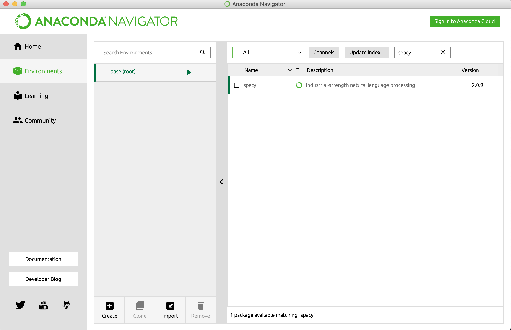
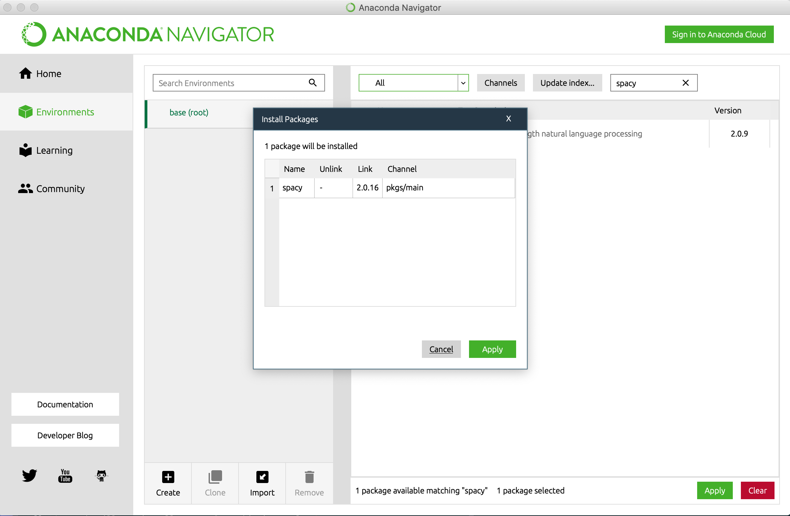
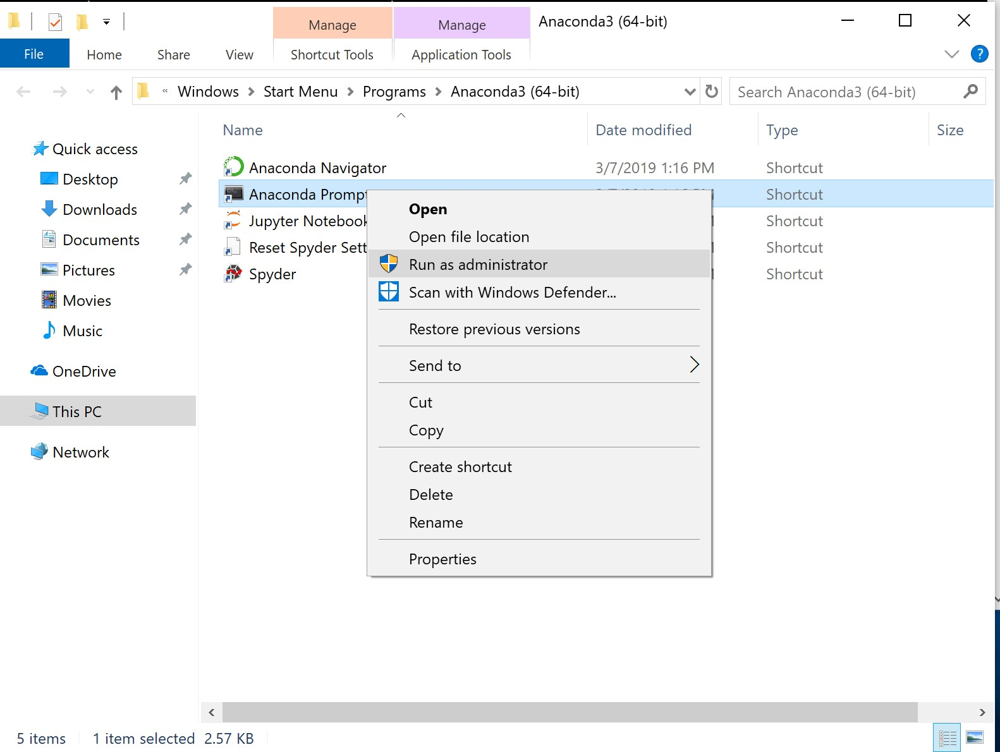

# QSTEP Masterclass: Social Media

[James](https://www.warwick.ac.uk/jamestripp) will be delivering this all day workshop on Tuesday the 19th of March. This repository contains preparatory details and the files used in when delivering the workshop.

The workshop covers some methods for downloading, analysing and visualising social media data using the R programming language.

# Preparation

## Pre-prerequisites

No prior experience of R is assumed. Though students may find it useful to work through the [CIM introductory workshop](https://warwick.ac.uk/fac/cross_fac/cim/people/academic-technology/rworkshop/) prior to attending. Those with a technical or statistical background may find [my qstep statistics workshops](https://github.com/jamestripp/qstep-workshops) useful too.

## Software installation

The software we will use is open-source and cross-platform. We use R for the programatic component and draw upon Python for natural language processing. Chrome with the dataminer and autoscroll extensions are optional.

Installing Chrome, R and RStudio should be straight forward on Windows, MacOS and Linux. Links for these are provided in the sections below. 

Installing Python and spaCY (to provide natural language processing) differs slightly between operating systems. Details instructions for each platform are given below.

### R and RStudio

**Note** The R version used in the creation of this workshop is 3.5.2 'Eggshell Igloo'.

R can be downloaded and installed from the [R project page](https://cloud.r-project.org). There are installers for both [Windows](https://cloud.r-project.org/bin/windows/base/) and [MacOS](https://cloud.r-project.org/bin/macosx/).

R can be installed on ubuntu by entering the following in the terminal:

```bash
sudo apt-get update
sudo apt-get install r-base
```

However, the version in the Ubuntu repository may be slightly older. If you want the latest version then one can add the r-project repository as detailed [here](https://www.digitalocean.com/community/tutorials/how-to-install-r-on-ubuntu-18-04).

RStudio is an integrated development enviroment (IDE) which makes working with R easier. RStudio can be downloaded from [here](https://www.rstudio.com/products/rstudio/download/#download).

### Chrome, DataMiner, Recipe Creator and Autoscroll

Chrome can be downloaded [here](https://www.google.com/chrome/). In the Chrome store, you can find the [Data Miner](https://chrome.google.com/webstore/detail/data-scraper-easy-web-scr/nndknepjnldbdbepjfgmncbggmopgden), [Recipe Creator](https://chrome.google.com/webstore/detail/recipe-creator/icadidhenmiokjlmpdgjikdoknhfgkhg) and [autoscroll](https://chrome.google.com/webstore/detail/autoscroll/kgkaecolmndcecnchojbndeanmiokofl/related).

We use Chrome and these extensions to download social media data. The social media page is loaded in the browser. Autoscroll allows us to jump to the bottom of the page and is useful for page which offer infinite scroll. Then recipe creator enables us to filter the data in our browser and download a csv file. The file can then be loaded into R and we can carry out an analysis.

### Python and spaCy

The simplest way to install Python for data science purposes is to install the Anaconda distribution. The installer is quite large and the process may take a while. 

#### Python

Anaconda includes lots of cutting edge Python packages. Python is a very widely used programming language which we are not going to use. There are lots of tutorials which can help you use python for data science such as [The Python Data Science Handbook](https://jakevdp.github.io/PythonDataScienceHandbook/) and the Real Python [Python Data Science Tutorials](https://realpython.com/tutorials/data-science/).


#### spacy

Spacy is a python module used for natural language processing. We are going to use this from R in order to classify the words downloaded from social media.

After installing Anaconda, go to the Anaconda-Navigator. Click on Environments, select All from the drop down box and type in spacy into the search box (as shown below).



Click on the checkbox and then apply. Anaconda will find the package you need to install. Click on Apply to install the packages (as shown below).



Anaconda will now install spacy. Once this is complete we can download the machine learning model we will use to classify our words in the last part of the workshop. The instructions for each operating system differ.

##### Windows 10

1. Go to the Anaconda install location
2. Right click on Anaconda Prompt and select 'Run as administrator' (see below screenshot)

3. Type into the prompt the following:
```bash
python -m spacy download en
```